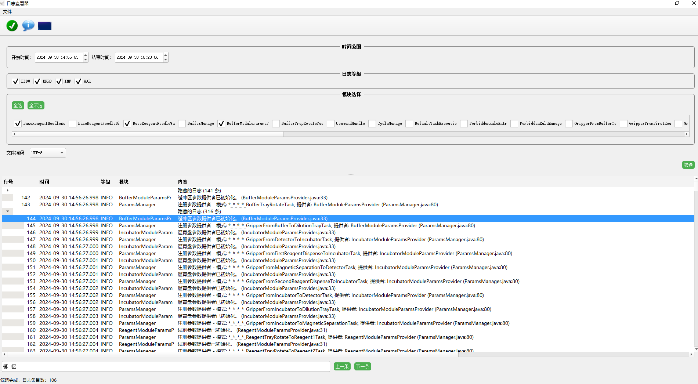

# README.md

# LogViewer

## Overview

**LogViewer** is a user-friendly log analysis tool designed to help developers and system administrators view and filter log files with ease. It supports reading large log files, filtering by multiple criteria such as timestamp, log level, and module, as well as folding and expanding log segments for focused examination.



## Features

- **Large Log File Support**: Efficiently handles large log files without performance degradation.
- **Time Range Filtering**: Select a specific time range to filter logs for better analysis.
- **Log Level and Module Filtering**: Filter logs based on log level (e.g., DEBUG, INFO, WARN, ERROR) or module name.
- **Expandable and Collapsible Log Segments**: Hide irrelevant logs with a collapsible tree view to focus on what matters.
- **Line Numbering**: Clear line numbers help in tracking specific log lines.
- **Real-Time Searching**: Quickly search and navigate to specific log entries using keywords.
- **Adaptive UI**: Responsive layout that adjusts column sizes and content visibility automatically.
- **Cross-Platform**: Works seamlessly on Windows, macOS, and Linux.

## Installation

### Prerequisites

- **Qt 5.xx or later**
- **CMake**
- **C++ Compiler** (e.g., GCC, MSVC)

### Build Instructions

1. Clone the repository:

   ```sh
   git clone https://github.com/yourusername/LogViewer.git
   cd LogViewer
   ```

2. Create a build directory and run CMake:

   ```sh
   mkdir build
   cd build
   cmake ..
   ```

3. Compile the project:

   ```sh
   make
   ```

4. Run the application:

   ```sh
   ./LogViewer
   ```

## Usage

- **Open Log File**: Click on the "File" menu and select "Open" to choose a log file.
- **Filter Logs**: Use the filter section to select a time range, log levels, and modules of interest.
- **Search Logs**: Enter text in the search box to highlight matching log entries and navigate through results.
- **Toggle Filters**: Use the "Toggle Filter Area" button to hide or show the filter settings, maximizing the space for log content when needed.

## Contributing

Contributions are welcome! If you encounter any issues or have ideas for improvements, feel free to submit an issue or a pull request.

1. Fork the repository.
2. Create a new branch (`git checkout -b feature-branch`).
3. Commit your changes (`git commit -m 'Add new feature'`).
4. Push to the branch (`git push origin feature-branch`).
5. Open a pull request.

## License

This project is licensed under the MIT License - see the [LICENSE](LICENSE) file for details.

## Acknowledgements

- **Qt**: The Qt Framework for the UI.
- **Contributors**: Special thanks to everyone who has contributed to the project.

## Contact

For questions or support, please reach out to [shapigege@gmail.com](mailto:shapigege@gmail.com).

Feel free to star the repository if you find it helpful!


